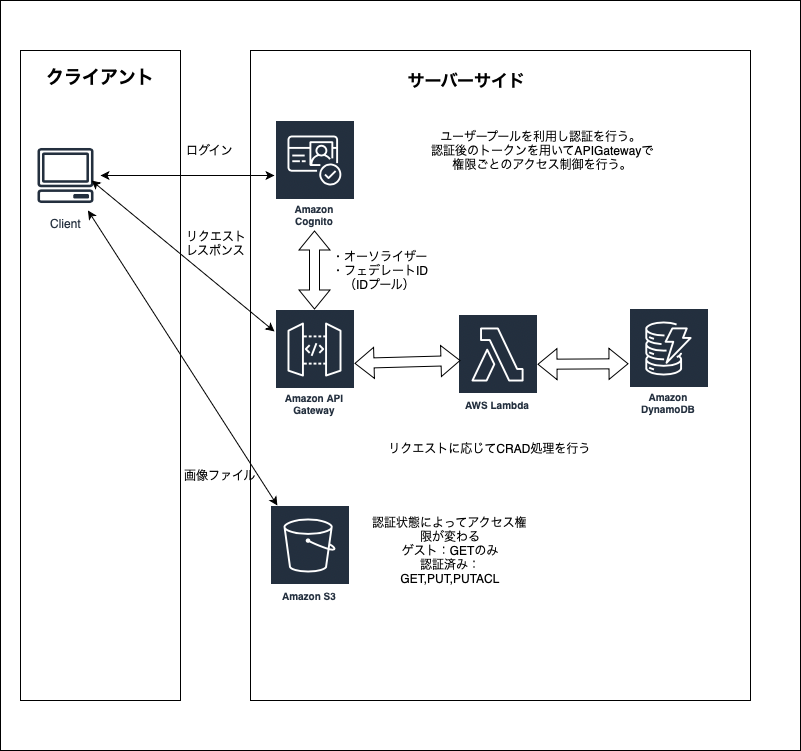
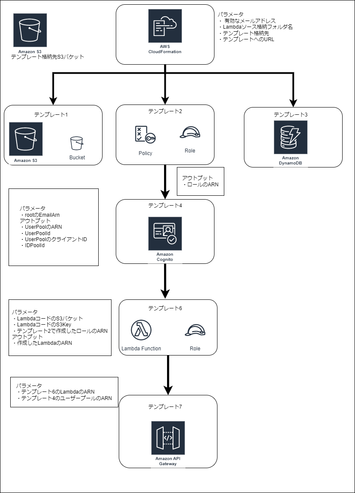
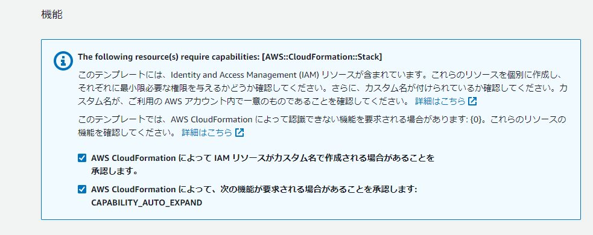
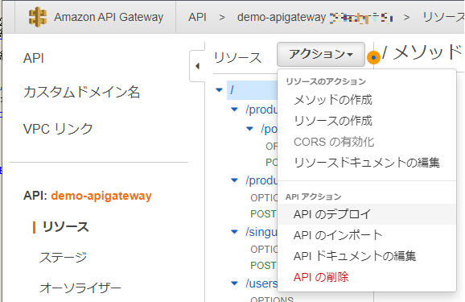
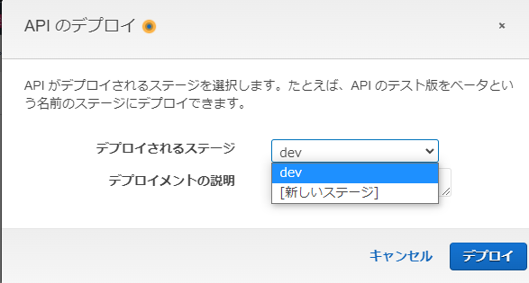
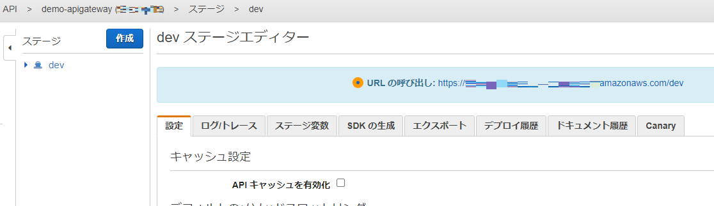

# 概要説明


### 作成するもの
以下の図でいうサーバーサイドをAWSリソースで構築する

<br>
<br>
<br>

### ディレクトリ構成と内容の概要  
```
├─ demo-CloudFormation 
│  ├─ demo-cloudFormation-nest ルートスタックにネストするテンプレート群
│  │  ├─ apigateway
│  │  │  └─ demo-apigateway.yaml APIGatewayのテンプレート
│  │  ├─ cognito
│  │  │  └─ demo-cognito.yaml APIGatewayのテンプレート
│  │  ├─ dynamodb
│  │  │  ├─ demo-product-tbl.yaml DynamoDB:demo-productテーブルのテンプレート
│  │  │  └─ demo-use-tbl.yaml DynamoDB:demo-userテーブルのテンプレート
│  │  ├─ iam
│  │  │  └─ demo-role.yaml IAMロールのテンプレート
│  │  ├─ lambda　
│  │  │  ├─ demo-product-lambda.yaml Lambdaのテンプレート
│  │  │  ├─ demo-product-list-lambda.yaml Lambdaのテンプレート
│  │  │  └─ dmeo-user-lambda.yaml Lambdaのテンプレート
│  │  ├─ s3
│  │  │  └─ demo-s3-upload.yaml 画像アップロード用S3のテンプレート
│  │  └─ demo-root.yaml ルートスタック
│  │
│  └─ lambda-code　Lambdaのソースコード
│      ├─ demo-product.zip
│      ├─ demo-product-list.zip
│      └─ demo-user.zip
└─ demo-root.yaml ルートスタック
```


# リソースの作成方法
テンプレートの作成方法は色々ありますが、その中の1つとしてAWSのマネジメントコンソールでの操作内容を記載  
rootスタックの動作イメージ図


### リソースの作成手順
1. S3からテンプレートを格納するS3バケットを作成する
2. 作成したS3バケットにdemo-CloudFormation\demo-cloudFormation-nestをディレクトリごとS3バケットにアップロードする
3.  作成したS3バケットにdemo-CloudFormation\lambda-codeをディレクトリごとS3バケットにアップロードする<br>
階層は以下のような形になる

```
作成したS3バケット名
├─ demo-cloudFormation-nest 
└─ lambda-code
```
4. CloudFormationから「スタックの作成」を押下  
テンプレートの準備完了が選択された状態で下部ウィンドウのテンプレート指定にある「Amazon S3 URL」に 2.で格納したディレクトリ配下の「demo-root.yaml」の「オブジェクト URL」を貼り付け右下部の「次へ」を押下
5. 「ステップ 1　スタックの作成」  
以下のようにパラメータを設定する  
スタックの名前: 任意  
パラメータ  
&ensp;　EmailArn： Cognitoの初期ユーザー登録時のメールアドレス 有効な任意のアドレス設定が必用  
&ensp;　LambdaCodeDirectory： Lambdaソース格納フォルダ名  
&ensp;　S3Buket： テンプレート格納先S3バケット名  
&ensp;　TemplateUrl： テンプレートへのURL  
例  
&ensp;　EmailArn： hogehoge@gmail.com  
&ensp;　LambdaCodeDirectory： lambda-code   
&ensp;　S3Buket： テンプレート格納先S3バケット名  
&ensp;　TemplateUrl： https://【テンプレート格納先S3バケット名】.s3.amazonaws.com/【テンプレート格納先S3オブジェクト名】/  
&ensp;　　　オブジェクトURLを元に組み立てると楽です。オブジェクト名未編集ならこんな感じ  
&ensp;　　　https://【テンプレート格納先S3バケット名】.s3.amazonaws.com/demo-cloudFormation-nest/


6. その他設定  
「ステップ 2　スタックの詳細を指定」、「ステップ 3　スタックオプションの設定」は設定不要なのでそのまま「次へ」  
「ステップ 4　レビュー」にて画像の通りチェックを入れ「送信」



7. リソース生成  
少々時間かかりますがこれでリソースの作成は完了  
&ensp; 成功するとステータスが「CREATE_COMPLETE」となる。  
&ensp; 失敗するとステータスが「ROLLBACK_COMPLETE」となる。  
&ensp; └　失敗した場合、途中まで生成されたものもロールバックして未生成となる。  
&ensp; └　主な原因はパラメータ設定不備と考えられるが原因は以下の方法で確認できます。

&ensp; 　失敗の原因確認は以下  
&ensp; 　　・rootスタックの「イベント」タブにて「CREATE_FAILED」となっている箇所をチェックし対応する  
&ensp; 　　・詳細な理由がない場合、rootスタックの「リソース」タブにて落ちているリソースの物理IDを押下し  
&ensp; 　　 そのスタックを参照、その後「イベント」タブにて「CREATE_FAILED」となっている箇所をチェックし対応する

8. 動作確認を行う場合はrootスタックの「出力」タブの内容を確認  
出力内容の説明  
&ensp; CognitoClientId：CognitoのアプリケーションクライアントID  
&ensp; CognitoIdentityPoolId：CognitoのIDプールID  
&ensp; CognitoUserPoolId：CognitoのユーザープールID  
&ensp; Region：リソースを作成したリージョン  
&ensp; S3UploadBucketName：テンプレートによって作成されたS3バケット名  
<br>
<br>
# 動作確認方法
作成したリソースの動作確認方法を記載  
[ ]で囲んでいる箇所にはリソース作成後の出力内容を適宜入力する  
クライアント作成して利用する場合は、「補足」を参照
<br>
<br>

## 1.Cognitoのユーザー登録とトークン取得
&ensp;AWS CLIを起動し以下のコマンドを入力する

1. list-usersサブコマンドでユーザープールができているかを確認  
期待値：レスポンスが返却されればOK  
```
aws cognito-idp list-users --user-pool-id [ユーザープールID]  
```
例：
aws cognito-idp list-users --user-pool-id hogehogehoge
以下説明は省きますが[]は不要  
&ensp; エラーが発生する場合には、現在のCLIで指定しているリージョン名が間違っている場合があります
2. admin-initiate-authサブコマンドで、現在のCognitoのセッション情報を取得  
&ensp; 仮パスワードはCloudFormationでリソース作成時に設定したEmailArnのメールアドレスに届いてます  
&ensp; [hogehoge.]の場合hogehogeと指定する  
```
aws cognito-idp admin-initiate-auth \
   --user-pool-id [ユーザープールID値] \
   --client-id [アプリクライアントID] \
   --auth-flow ADMIN_NO_SRP_AUTH \
   --auth-parameters USERNAME=demoUser,PASSWORD=[仮パスワード]
```

3. admin-respond-to-auth-challengeサブコマンドで正規パスワードを登録する
```
aws cognito-idp admin-respond-to-auth-challenge \
    --user-pool-id [ユーザープールID] \
    --client-id [アプリクライアントID] \
    --challenge-name NEW_PASSWORD_REQUIRED \
    --challenge-responses 'NEW_PASSWORD=[新しいパスワード],USERNAME=demoUser' \
    --session [先程のセッション値]
```

4:再度admin-initiate-authサブコマンドを新パスワードでたたいてログイン状態にする
```
aws cognito-idp admin-initiate-auth \
   --user-pool-id [ユーザープールID値] \
   --client-id [アプリクライアントID] \
   --auth-flow ADMIN_NO_SRP_AUTH \
   --auth-parameters USERNAME=demoUser,PASSWORD=[新パスワード]
```

## 2.REST APIの動作確認
1. APIGatewayをデプロイしURLを取得する  
・APIGateway＞リソース＞アクションを押下  
以下画像ではリソースのメソッドにOPTIONSの記載がありますがその点は無視でOKです
  
<br>
・デプロイされるステージにて「dev」を選択し「デプロイ」を押下 
  
<br>
・URLの呼び出しに表示されたURLを以下で使用する  

2. curlなりその他ツールなりでAPIを叩く  
例  
demo-userテーブルへのアクセス 

PUTの場合  
```
curl -X POST \
 -H "Content-Type: application/json" \
 -H "Authorization: [cognitoIDトークン]" \
 -d "{"OperationType": "PUT","Keys": {"userId": "demoUser"}}" \
 [APIGatewayステージURL]/users \
```

QUERY(GET)の場合
```
curl -X POST \
 -H "Content-Type: application/json" \
 -H "Authorization: [cognitoIDトークン]" \
 -d "{"OperationType": "QUERY","Keys": {"userId": "demoUser"}}" \
 [APIGatewayステージURL]/users \
```

demo-productテーブルへのアクセス  

PUTの場合  
```
curl -X POST \
 -H "Content-Type: application/json" \
 -H "Authorization: [cognitoIDトークン]" \
 -d "{"OperationType": "PUT","Keys": {"productName": "demoProduct","productCategory": "food","productContributor": "demoUser","productContributorId": "demo-user","productExplanation": "demoProduct","productImageUrl": "","productQuantity": "1"}}" \
 [APIGatewayステージURL]/productitem/postitem \
```

QUERY(GET)の場合 このリクエストのみ認証不要としている  
```
curl -X POST \
 -H "Content-Type: application/json" \
 -d "{"OperationType": "QUERY","Keys": {"productCategory":"food"}}" \
 [APIGatewayステージURL]/productlist \
```

# 補足
クライアントアプリを作成して動かす場合はAPIGatewayで以下の設定を行う
1. リソース＞アクションにて「CORSの有効化」で必用な設定を行った後「CORSを有効にして既存のCORSヘッダーを置換」を押下  
この設定を必用なアクセスポイントすべてに行う
2. API のデプロイを行うとクライアント側からのリクエストを処理できる
3. おまけ
&ensp; 作成されたリソースに合わせクライアントアプリを準備  
触るならREADMEの起動方法載せております。  
(UI未考慮、バグありきの粗末なもの)↓  
[AngularのクライアントアプリとAWSリソースを連携：お試し程度の画面 ](https://github.com/yomo-maki/demo-serverless-client)

